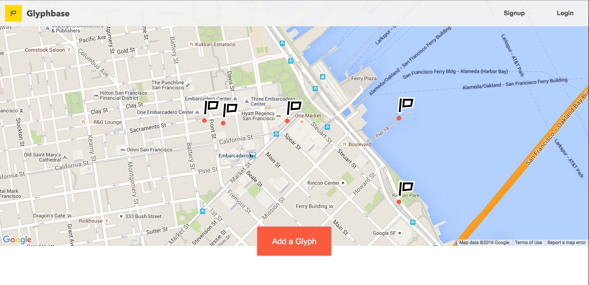
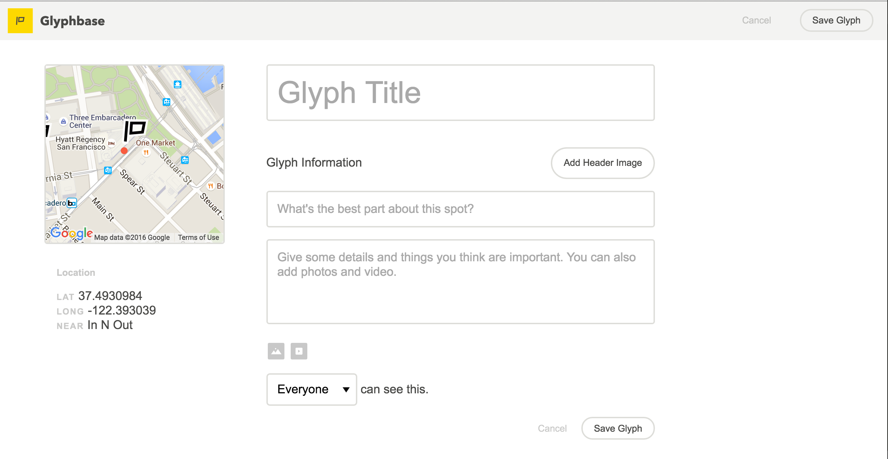

## About

Glyphbase is a social, location-centric web app that allows users to share insights about the world around them, tying digital data to physical locations. It's about making our physical world as rich in context as our virtual world. Standing in front of a beautiful street mural, I want to know who the artist was and what they were trying to say. I want to discover more of their work and share my experience with others who pass by long after I move on.

I’m interested in shared experiences, in knowing what someone else thought or saw when they were looking at the same scene as me.  Location provides context that much of our current online discourse lacks; it’s a reference point and it’s also a qualifier: you belong and get it if you’ve been there.

So much social media today involves passive consumption.  We sit back and watch the messages roll in.  I want to engage our users, get them off the couch, prompt them to go and see the world.  I want to use that experience of going and seeing to connect people in a more authentic way.

I want to see unique art installations coupling the digital world and the real world.  I want to hear how you met and proposed to your wife right here.  I want to know that you think you lost your favorite bracelet somewhere nearby, and I want to find it and return it to you.  I want to post notes that are only relevant to my neighbors, or tell a future hiker where he/she can find firewood or a good campsite.  I want someone to make a “missed connection” on the 14 bus and go have coffee with their future spouse.

## Screenshots

